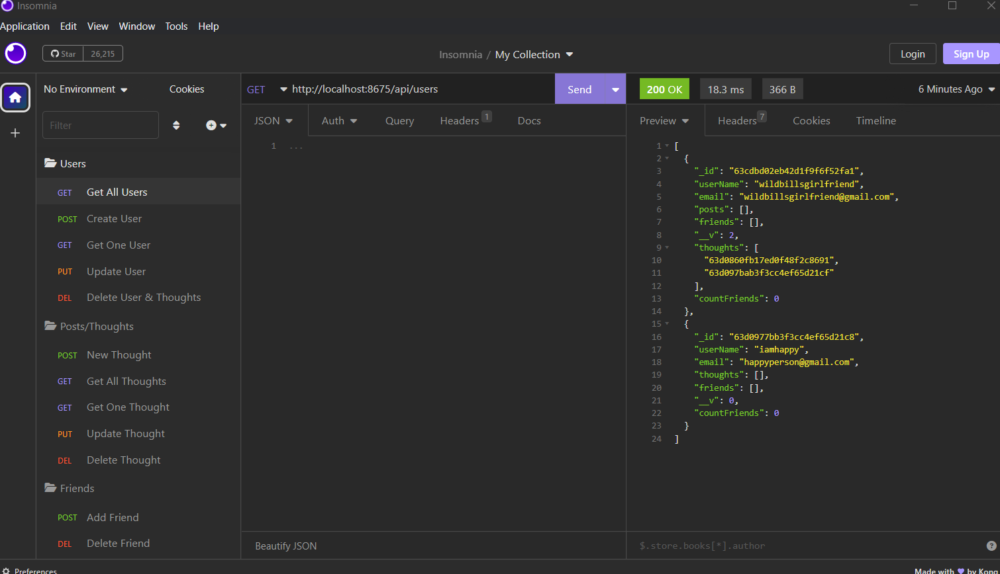
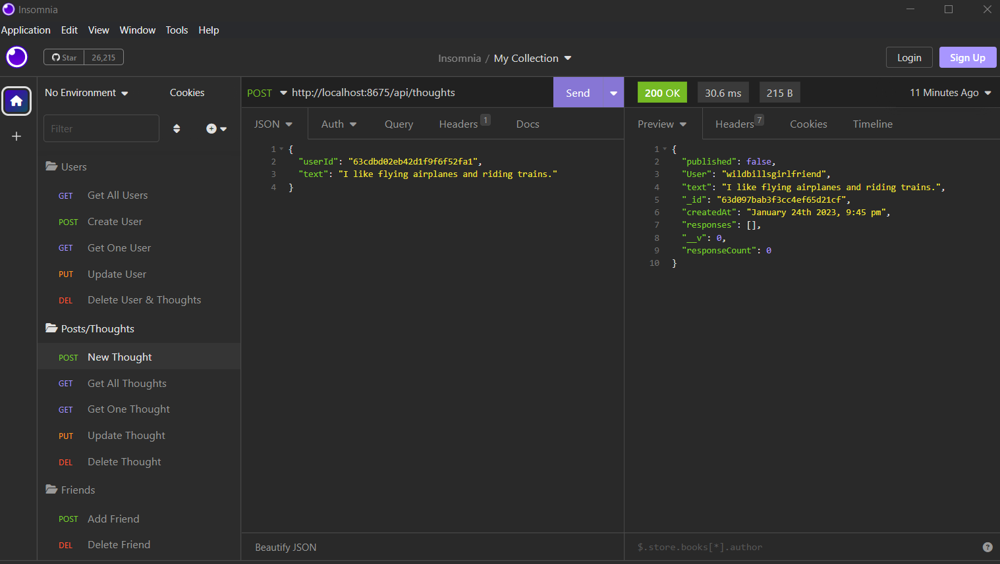
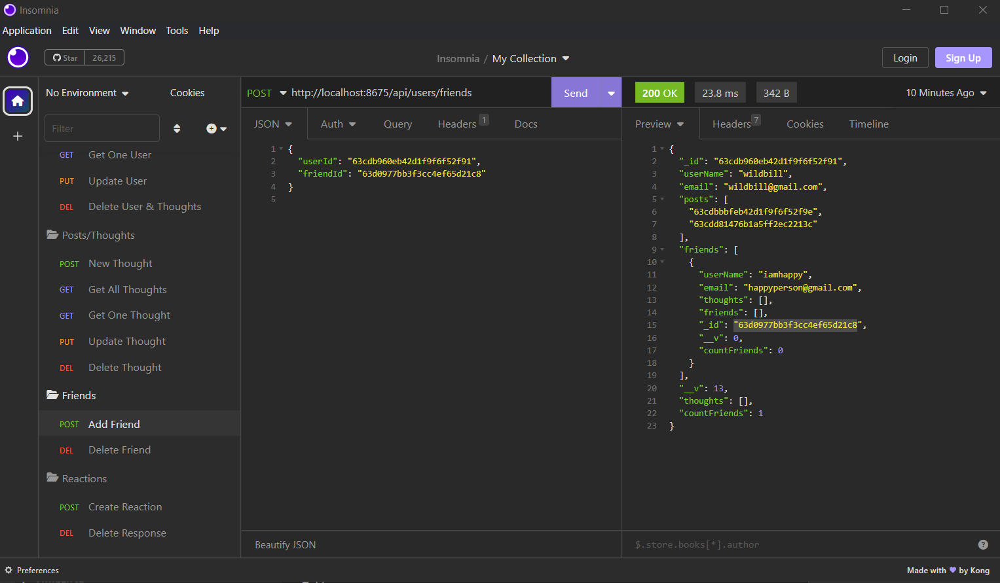
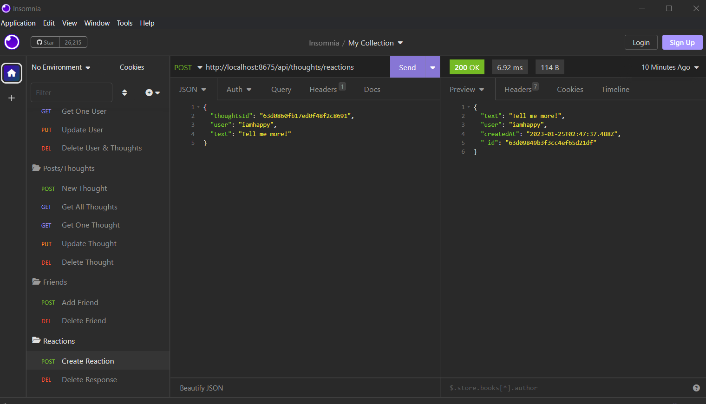

# noSql

## Table of Contents 
- [Application Image](#application-image)
- [Installation Instructions](#installation)
- [Instructions](#instructions--usage)
- [Usage Video](#usage-video)
- [License](#license)
- [Questions](#questions)

## Application Image 

## Installation Instructions
To install the application, you would download the readme-generator repository (https://github.com/MicheleTornetta/noSQL).  From there you would navigate to the directory in the command terminal.  Once there the user will need to type in npm i to download the dependencies. 

## Instructions
Once dependecies are dowloaded, open the terminal and type in node server and be sure MongoDB is open. The user should then open insomnia to search for one user, all users, add, change and delete users. Also, the user can look at all posts/thoughts, one post/thought0, add new posts/thoughts, change, delete or update posts/thoughts. In addition, using insomnia, the user can add or delete reactions and friends.  All changes will be saved in the database.

## Usage Video
An example of how it works can be viewed here: 
[Watch the video](https://www.youtube.com/watch?v=WPV9oNd1t20)

## License 
A short, permissive software license. Basically, you can do whatever you want as long as you include the original copyright and license notice in any copy of the software/source.  There are many variations of this license in use.

## Questions
If you would like to contribute or you simply have questions, please visit: 

https://github.com/MicheleTornetta

or email me at:
mlt@pwahsolutions.com
